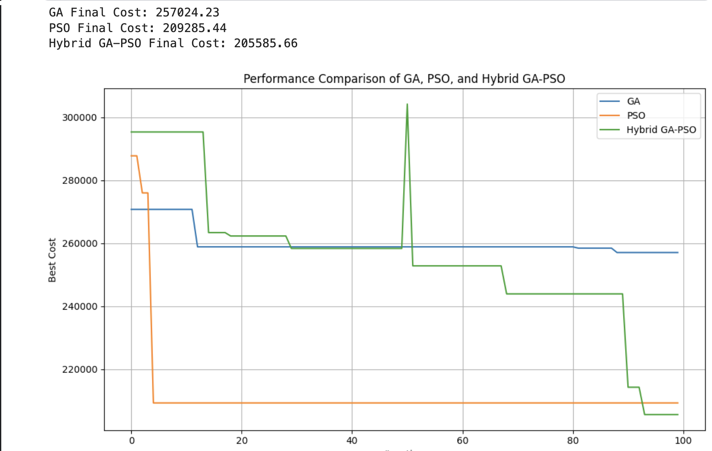
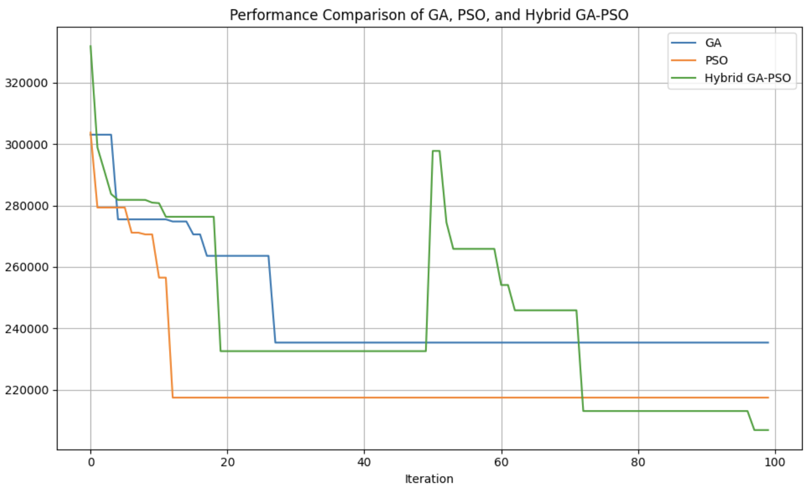

# 🚀 Hybrid GA-PSO Algorithm for Supply Chain Optimization

## 📌 Overview
This project implements a **Hybrid Genetic Algorithm (GA) and Particle Swarm Optimization (PSO)** approach to solve complex **Supply Chain Optimization** problems.

The hybrid approach leverages:
- **GA (Genetic Algorithm)** → Strong global exploration using selection, crossover, and mutation  
- **PSO (Particle Swarm Optimization)** → Fast convergence using swarm intelligence  

By combining both, the model achieves better optimization performance, avoiding local minima and improving convergence speed. :contentReference[oaicite:1]{index=1}  

---

## 🎯 Problem Statement
Efficient supply chain management requires optimizing multiple factors such as:
- Transportation cost  
- Inventory levels  
- Distribution routes  
- Demand fulfillment  

Traditional optimization methods struggle with:
- High-dimensional search spaces  
- Non-linear constraints  
- Dynamic environments  

This project addresses these challenges using a **hybrid metaheuristic approach**.

---

## ⚙️ Methodology

### 🔹 Genetic Algorithm (GA)
- Population initialization  
- Fitness evaluation  
- Selection  
- Crossover  
- Mutation  

### 🔹 Particle Swarm Optimization (PSO)
- Particle initialization  
- Velocity & position updates  
- Personal best (pBest) & global best (gBest)  

### 🔹 Hybrid Approach
The algorithm integrates:
- GA operators for diversity  
- PSO updates for fast convergence  

This balance improves both **exploration and exploitation** capabilities.

---

## 🧠 Key Features
- 🔁 Hybrid GA-PSO optimization  
- 📊 Flexible fitness function design  
- ⚡ Faster convergence than standalone GA/PSO  
- 🔧 Modular and customizable code  
- 📦 Applicable to real-world supply chain problems  

---
### 📊 Observations
- Hybrid GA-PSO converges faster than GA
- Avoids premature convergence
- Achieves lower cost (better fitness)
## 📈 Results

| GA Convergence | Hybrid GA-PSO |
|----------------|--------------|
|  |  |
